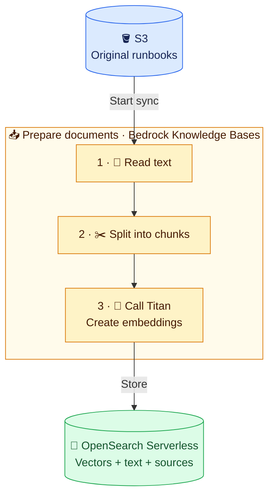
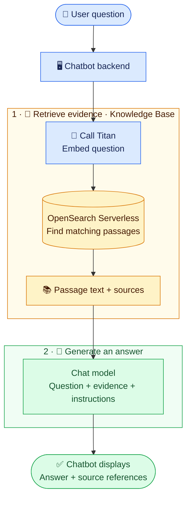

# 🧭 Architecture and Workflow

## 🎯 What are we building?

A chatbot that answers questions from DevOps documents.

**Example:** “How do I roll back the staging API?” → find the rollback passage → explain it with a source reference.

It does not inspect a live EKS cluster, execute commands, or train the chat model.

## 🧩 The parts

**🟡 Planned system:** All diagrams below describe the design; no AWS resources are deployed. View them in a Markdown preview with Mermaid support.

| Part | Job |
| --- | --- |
| S3 | Keep original runbooks and incident notes |
| Bedrock Knowledge Bases | Coordinate reading, splitting, embedding, and retrieval |
| Titan embedding model | Turn text into vectors: lists of numbers used to compare meaning |
| OpenSearch Serverless | Store and search chunk vectors, text, and metadata |
| Bedrock chat model | Write an answer using retrieved passages |
| Chatbot | Send questions and display answers with sources |

**Metadata:** labels such as source filename or environment. **Ingestion:** preparing documents so they can be searched.

## 📥 Flow 1: Prepare documents

**Text version:** S3 → sync → read → split → embed → store.

- A **chunk** is a smaller passage from a document.
- **Overlap** repeats text between neighbouring chunks to preserve context.
- Start with fixed-size chunking: configured rules select boundaries.
- Titan embeds the text afterward; it does not select these boundaries.
- Uploading to S3 and syncing the Knowledge Base are separate steps.
- Chunking settings belong to the data source connection inside the KB. Bedrock performs the chunking during sync; S3 originals remain unchanged.
- Inspect retrieved passages to check whether useful instructions stay together.

## 💬 Flow 2: Answer a question

**Text version:** question → embed → search → evidence → chat model → answer.

- Use the same embedding model and compatible settings for documents and questions.
- **Retrieval** finds passages. **Generation** writes the answer.
- **Top-K** is the number of matching results requested, not a correctness score.
- The chat model reads retrieved text, not vectors as runbook instructions.
- Bedrock's `Retrieve` returns passages; `RetrieveAndGenerate` also produces an answer.
- Test retrieval first, then generated answers.

## 🧪 One example

| Step | Example |
| --- | --- |
| Source | Staging runbook contains the approved rollback command |
| Question | “How can I undo the staging API release?” |
| Retrieval | Return the passage describing rollback |
| Generation | Explain the procedure and cite the source |
| Check | Confirm the answer matches the environment and documented steps |

If the procedure is absent, we want the chatbot to acknowledge missing evidence. Test this behaviour: a prompt or citation does not guarantee correctness.

## 🔐 Controls we will add

- **IAM (Identity and Access Management):** permit only required AWS operations.
- **OpenSearch policies:** control data access, network access, and encryption.
- **Guardrails:** configured content checks on requests and answers.
- Guardrails do not replace document permissions or guarantee factual correctness.
- Protect retrieved source text too; stored documents are not automatically sanitised.

## ♻️ Later experiments

- Change a runbook → sync → check the new instructions are retrieved.
- Delete a source → sync with intended deletion settings → check old chunks disappear.
- Change embedding models → plan a compatible replacement store and re-embed.
- Send a small concurrent workload → measure delays/errors → identify bottlenecks.

These experiments have not run. Check current AWS behaviour and document exact steps when we reach each topic.

## 🧠 Learning depth

- **Understand well:** both flows, component roles, evidence, and source freshness.
- **Concept only:** how vector search finds related meaning.
- **Basic awareness:** how components scale under higher demand.

## 🙋 Check your understanding

1. You uploaded a corrected runbook. What must happen before testing its answer?
2. Which model creates vectors, and which writes the answer?
3. Why inspect retrieved chunks before changing a chat model that answers incorrectly?
4. Does the chatbot know your EKS cluster's current health? Why?

Discuss these before setup. No commands to run for this step.

## 🔗 AWS reference

[Query a Knowledge Base and generate responses](https://docs.aws.amazon.com/bedrock/latest/userguide/kb-test-retrieve-generate.html)

## 🎤 Interview FAQ

**1. Why use RAG for runbooks?**  
It supplies relevant internal documentation at question time without training the model on it.

**2. Why both S3 and OpenSearch?**  
S3 holds original files. OpenSearch holds searchable chunk text, vectors, and labels.

**3. What does Knowledge Bases manage?**  
Document preparation and retrieval. We still choose settings, grant access, and check results.

**4. Do we need an agent?**  
No. Direct Knowledge Base retrieval and answer generation are enough here.

**5. What makes an answer trustworthy?**  
Relevant, current, permitted evidence and checks that the answer agrees with it. Citations help inspection but are not proof by themselves.
