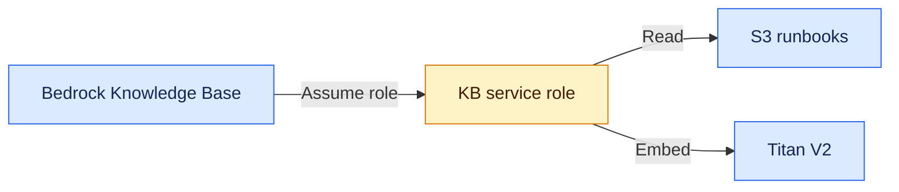

# ⚙️ Knowledge Base setup

**Now:** prepare Bedrock's service role. Collection, index, Knowledge Base, and sync are still pending.

## 🔐 Why a service role?

Read [Who can do what?](06_permissions_explained.md) for the short permissions map and verification examples.

Your deployment profile creates resources. Bedrock uses a separate role to read runbooks and create embeddings.

- **Trust policy:** who can assume the role — Bedrock, for KBs in this account and Region.
- **Permissions policy:** what it can do — list the lab bucket, read `runbooks/`, and invoke Titan Text Embeddings V2.
- **PassRole:** lets your deployment identity assign this role to Bedrock; it does not let Codex assume it.

Text: Bedrock assumes the service role to access S3 and Titan. All role resources here remain planned until execution is verified.

## 📁 Local file guide

Files under `.local/` are ignored and contain account-specific values:

| File | Purpose |
| --- | --- |
| `kb-trust-policy.json` | Restricts who can assume the role using source account and KB ARN conditions |
| `kb-source-embedding-policy.json` | Read only the lab's runbook objects and invoke the exact Titan V2 model |

After KB creation, restrict the trust policy to its exact ID. OpenSearch permission will be added separately using the actual collection ARN; this initial role is not yet sufficient for full ingestion.

## ▶️ Current activity

Run CLI steps **09–10** in the [execution guide](03_cli_execution.md). Creating the role and attaching its policy have no IAM fee and do not invoke Titan. Model usage becomes billable when ingestion/query requests execute.

OpenSearch cost/capacity verification remains open. Do not create a collection yet. We will keep that billed portion of the lab short and clean it up after evidence collection.

Source: [AWS KB service-role guidance](https://docs.aws.amazon.com/bedrock/latest/userguide/kb-permissions.html).

## 🧠 Learning depth

**Understand well:** trust policy, permission policy, and PassRole. **Concept only:** service-to-service role assumption.

## 🎤 Interview FAQ

**1. Why not give Bedrock my access key?** A service role provides temporary credentials through AWS role assumption.

**2. What does the trust policy control?** Who can assume the role and under what conditions.

**3. What does the permissions policy control?** Which actions the assumed role can perform on which resources.

**4. Does creating this role start ingestion?** No; we still need the vector store, KB, data source, and sync.

**5. Why restrict the S3 prefix and model ARN?** The role should access only the data and model required by the lab.
