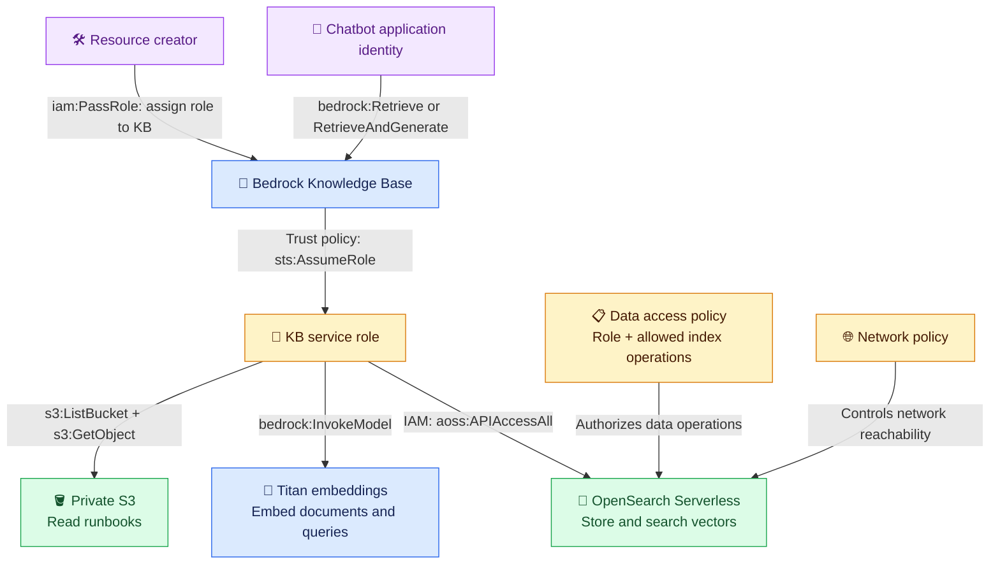

# 🔐 RAG permissions: who accesses what?

**Understand well:** a role is an AWS identity; policies define who can use it and what it can access.

**Status:** S3 is verified. The service role, Knowledge Base, Titan calls, and OpenSearch connections below are planned or awaiting verification.

## 🗺️ Permission flow

**Text:** the creator assigns a role to the KB. Bedrock assumes it to read S3, call Titan, and access OpenSearch. The chatbot uses its own identity to query the KB. Arrows show authorization, not execution order.

## 🔑 Who needs which permission—and why?

| Entity | Permission / policy | Purpose and scope |
| --- | --- | --- |
| Resource creator | `iam:PassRole` | Assign the specific service role when creating the KB; resource creation also needs the relevant create permissions. |
| Bedrock service | Role **trust policy**: `sts:AssumeRole` | Use the KB role temporarily. Trust `bedrock.amazonaws.com`, restricted by source account and KB ARN. |
| KB service role → S3 | `s3:ListBucket`, `s3:GetObject` | Discover files in the source bucket and read documents under the runbook prefix. |
| KB service role → Titan | `bedrock:InvokeModel` | Call the selected embedding model to turn document chunks and queries into vectors. |
| KB service role → OpenSearch | IAM `aoss:APIAccessAll` **plus data access policy** | Reach the collection API and perform allowed operations on the intended vector index, such as reading and writing documents. |
| Chatbot application → KB | `bedrock:Retrieve` or `bedrock:RetrieveAndGenerate` | Fetch passages or request a grounded answer. Generation also needs the applicable model permissions for the chosen API/model. |

**Trust ≠ permission:** trusting Bedrock to assume the role does not itself grant access to S3, Titan, or OpenSearch. Scope each grant to the required resources. [AWS service-role guidance](https://docs.aws.amazon.com/bedrock/latest/userguide/kb-permissions.html)

## 🛡️ Additional resource controls

| Layer | Why it exists |
| --- | --- |
| S3 Block Public Access | Keeps documents private while allowing authorized role access. |
| OpenSearch data access policy | Names the role and the collection/index operations it may perform; IAM API access alone is insufficient. |
| OpenSearch network policy | Controls how the collection endpoint can be reached; reachability alone grants no data access. |
| Encryption policy/settings | Protect stored data. They do not grant permission to read it. Customer-managed KMS keys need additional key permissions where applicable. |

An applicable **explicit deny overrides an allow**. Successful ingestion and retrieval—not merely saved policies—verify the complete access path. [OpenSearch data access](https://docs.aws.amazon.com/opensearch-service/latest/developerguide/serverless-data-access.html) · [Network access](https://docs.aws.amazon.com/opensearch-service/latest/developerguide/serverless-network.html) · [IAM evaluation](https://docs.aws.amazon.com/IAM/latest/UserGuide/reference_policies_evaluation-logic.html)

## 🎤 Interview FAQ

**1. Why does the KB need a service role?** Bedrock uses it to access the source documents, embedding model, and vector store.

**2. Trust policy versus permissions policy?** Trust defines who may assume the role; permissions define what that role may do.

**3. PassRole versus AssumeRole?** The creator assigns the role with PassRole; Bedrock uses it through AssumeRole.

**4. Why two S3 permissions?** ListBucket discovers object names; GetObject reads their contents.

**5. Why several OpenSearch policies?** IAM allows API access, the data policy authorizes index operations, and the network policy controls reachability.

**6. Does the chatbot need the KB service role?** No. Its own identity calls the KB; Bedrock uses the service role for backend access.
