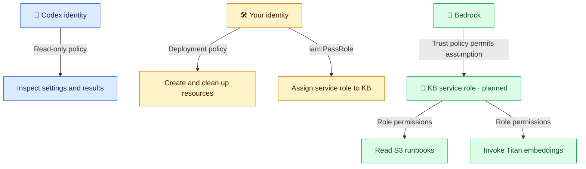

# 🔐 Who can do what?

**Understand well:** identities, roles, trust, permissions, and PassRole.

**Basic awareness:** additional OpenSearch access layers, planned for the next setup activity.

## 🧩 Five words to remember

| Word | Meaning |
| --- | --- |
| Profile | Local CLI settings that select an AWS identity; the name grants no permissions |
| Principal | The user, role session, or AWS service making a request |
| Role | An identity assumed temporarily; Bedrock uses a service role |
| Policy | Rules defining allowed/denied actions and their scope |
| Permission | An action allowed on a resource when the required conditions hold |

## 👥 Three identities, separate jobs

| Who | Where permissions live | Why grant them? |
| --- | --- | --- |
| Codex inspection user | Attached read-only IAM policy | Inspect settings/results; explicitly deny operations outside the inspection list |
| Your deployment user | Attached deployment IAM policy | Create/configure lab resources, run tests, and delete them afterward |
| Bedrock service role | Trust policy + attached role permissions | Let Bedrock read runbooks, invoke Titan, and later access the vector store |

**Your permissions are not automatically inherited by Bedrock.** Local policy JSON is only a file until applied to AWS.

**Text:** Codex inspects. You deploy and assign the role. Bedrock assumes that role and uses its permissions. Role creation and use remain unverified.

## 🔑 Three different permission checks

| Check | Attached to | Question answered | Our restriction |
| --- | --- | --- | --- |
| `iam:PassRole` | Deployment user | Can you assign this role to Bedrock? | Exact lab role; `iam:PassedToService` is Bedrock |
| Trust policy | Service role | Who may assume this role? | Bedrock; matching source account and regional KB ARN |
| Permissions policy | Service role | What may the assumed role do? | List the lab bucket, read `runbooks/*`, invoke the exact Titan V2 model |

`PassRole` does not assume the role. Trust does not grant S3 access. S3 access does not grant model invocation.

## 📄 Read a policy statement

**Who → action → resource → conditions → allow/deny**

- **Principal:** who is trusted; explicit in the role's trust policy. For a user permissions policy, its attachment identifies the user.
- **Action:** operation, such as `s3:GetObject`.
- **Resource:** target ARN (AWS resource identifier), such as the lab bucket's `runbooks/*` objects.
- **Condition:** extra requirement, such as Region, source account, or `Project=rag-bedrock` tag.
- **Effect:** `Allow` or `Deny`. An applicable explicit deny overrides an allow; without applicable authorization, access is denied.

`Resource: "*"` means all resources for the listed actions—not permission for every action. Our Codex policy uses **Deny + NotAction** to block everything outside its explicit inspection list. Other attached policies and account controls also affect effective access.

## 🚪 OpenSearch has additional doors — planned

| Layer | Purpose |
| --- | --- |
| IAM collection-management permissions | Let your deployment user create/configure/delete the collection |
| IAM `aoss:APIAccessAll` | Allow collection API access for the caller; it is not sufficient alone |
| Data-access policy | Name the permitted principals and their collection/index operations |
| Network policy | Decide which network paths/services can reach the endpoint |
| Encryption policy | Choose the key protecting stored data; does not grant document access |

For Bedrock, we will grant vector-store access to the **service role**. For manual index setup, access belongs to **your deployment identity**. Codex's policy does not grant collection data-plane access. These layers are not yet configured.

## ✅ What proves a permission works?

| Evidence | What it proves |
| --- | --- |
| Valid local JSON | File structure only |
| Policy attached in AWS | Configuration saved, not every action tested |
| Successful STS identity check | Which identity is in use |
| Successful model listing | Listing access, not model invocation |
| Successful S3 upload | That caller could write that object at that time |
| Successful future KB sync | The exercised ingestion path worked; inspect job results too |

**Observed:** inspection calls and your S3 creation/upload worked. **Pending:** service-role creation, role assumption, Titan invocation, and OpenSearch access. A failed call's action/resource explains which permission needs investigation; it is not a reason to grant administrator access.

Local file purposes: [profile policies guide](02_access_and_costs.md) · [service-role file guide](05_knowledge_base_setup.md). Account-specific JSON stays in ignored `.local/`.

AWS references: [Policies](https://docs.aws.amazon.com/IAM/latest/UserGuide/access_policies.html), [PassRole](https://docs.aws.amazon.com/IAM/latest/UserGuide/id_roles_use_passrole.html), [KB service role](https://docs.aws.amazon.com/bedrock/latest/userguide/kb-permissions.html), [OpenSearch access](https://docs.aws.amazon.com/opensearch-service/latest/developerguide/serverless-data-access.html).

## 🎤 Interview FAQ

**1. Is an AWS profile a role?** No; it is local configuration selecting credentials or a role to use.

**2. Trust versus permissions?** Trust controls who assumes a role; permissions control what it can do.

**3. Why PassRole?** To authorize assigning a specific role to a service without handing over keys.

**4. Why can deployment succeed but ingestion fail?** The deployment identity and Bedrock's service role have different permissions.

**5. Does a successful read prove write access?** No; each action and resource is checked separately.

**6. Does a network policy grant OpenSearch document access?** No; IAM and data-access permissions must also allow the operation.
